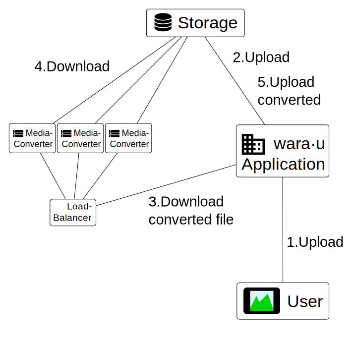

## Design goals

* The converter should be part of a larger framework for delivering photos and videos.
* The main use-case would be as a worker that converts files before being watched.
* On-the-fly transcoding is a minor use-case
* It should be easy to use and it should be distributable across multiple machines.

## Design options

* Send a file to the converter via POST, receive the converted file in the response. Specify size and format in the path or as query-parameter
    * PROS: Simple interface, streaming is possible
    * CONS: Only on file at a time, only one size/format possible at a time. We may want to create different thumbnails-sizes in one go. In such a case,  
    file would have to be uploaded multiple times.
* Send a file to the converter via POST, receieve mutliple results via multipart-response
    * PROS: Streaming possible, more or less
    * CONS: [Multipart responses are not widely used][buzilla-moz843508] and [not supported well by browsers][so-browser-support]. This method is not intuitive.
* Send the URL of a media-file to the converter via GET and receive the converted file in the response. Provide size and format in the path (or as 
query-parameter).
    * PROS: Streaming possible, caching possible. Multiple conversions of the file can be done simultanously. 
    * CONS: Source URL must be reachable from worker.

I have chosen the last option for multiple reasons:

* The goal is to integrate the converter as worker; the setup should always be possible such that the converter accesses the URL
* It may be possible to integrate standard tools (like caching proxies and load-balancers) to perform on-the-fly conversion.

## Architecture

This is the architecture I decided to implement

Icons are made by <a href="http://www.flaticon.com/authors/google" title="Google">Google</a> downloaded from <a href="http://www.flaticon.com" 
title="Flaticon">www.flaticon.com</a> and licensed by <a href="http://creativecommons.org/licenses/by/3.0/" title="Creative Commons BY 3.0" target="_blank">CC 3.0 BY</a>

 

1. The user uploads a file to Wara&middot;u
2. Wara&middot;u stores the file into the attached storage
3. Wara&middot;u sends a conversion request to (i.e. attempts to download the converted files from) to the converters
4. One converter downloads the original file from the storage and returns the converted file to 
   Wara&middot;u
5. Wara&middot;u stores the converted file into the storage

Another option is *not* to store the converted file into the storage, but to use a caching HTTP proxy 
in front of the load-balancer.

   

[buzilla-moz843508]: https://bugzilla.mozilla.org/show_bug.cgi?id=843508#c0
[so-browser-support]: http://stackoverflow.com/questions/1806228/browser-support-of-multipart-responses#answer-1829995
